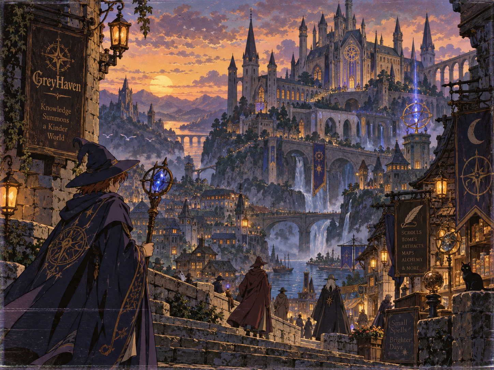

# Greyhaven Stijlgids (art bible)

> **Referentiepunt voor alle visuals in de game.** Elk nieuw beeld, elke kleur in de code en elk UI-element moet aan deze regels voldoen.
> Werktitel "Greyhaven" komt van het uithangbord in het referentiebeeld.

## Bestanden in deze map

| Bestand | Wat |
|---|---|
| `README.md` | Deze stijlgids: alle regels (bron van waarheid) |
| `reference.png` | Het originele referentiebeeld |
| `tokens.css` | Kleuren, fonts en gloed als CSS-variabelen, direct te importeren |
| `tokens.json` | Dezelfde tokens als JSON (voor JS/TS, game-engine of tooling) |
| `prompts.md` | AI-prompts om nieuwe beelden in deze stijl te genereren |
| `stijlgids.html` | Visuele versie van deze gids, open in de browser |
| `models.md` | Wat we aanleveren voor de echte personage-modellen (bestanden, maten, materialen, animaties) |

**Regel voor code:** gebruik in de code nooit losse kleurcodes. Altijd een token uit `tokens.css` / `tokens.json`. Nieuwe kleur nodig? Eerst hier toevoegen.

---

## De kern

Handgeschilderde anime-fantasy uit de jaren '80 en '90: een magische stad in de schemering, warm verlicht, vol details en verwondering. Gezellig, nooit grimmig.

| Pijler | Betekenis |
|---|---|
| **Schemer** | Altijd het moment tussen dag en nacht. Warm tegen koel. |
| **Diepte** | Lagen, mist en verte. Je wilt erin wandelen. |
| **Ambacht** | Het moet eruitzien alsof iemand het met de hand schilderde. |
| **Verwondering** | Hoopvol en uitnodigend. Magie is mooi, geen bedreiging. |

## Kleurpalet

| Token | Naam | Hex | Gebruik |
|---|---|---|---|
| `--gh-nachtinkt` | Nachtinkt | `#1B1A2B` | Diepste schaduwen, nachtlucht, UI-achtergrond |
| `--gh-schemerviolet` | Schemerviolet | `#4A3F6B` | Schaduwen op steen en wolken, mantels |
| `--gh-mistpaars` | Mistpaars | `#6E6A8E` | Verte, mist, water in de schaduw |
| `--gh-steengrijs` | Steengrijs | `#7C7468` | Muren, trappen, gewone gear |
| `--gh-zonsondergang` | Zonsondergang | `#E5A06A` | Lucht, warme reflecties |
| `--gh-zonlicht` | Zonlicht | `#F6D27F` | Zon, legendarische gloed, highlights |
| `--gh-lantaarnamber` | Lantaarnamber | `#E39B3E` | Lantaarns, ramen, fakkels, hoofdknoppen |
| `--gh-ornamentgoud` | Ornamentgoud | `#C9A25B` | Borduursel, symbolen, randen, kopjes |
| `--gh-magieblauw` | Magieblauw | `#5F6DFF` | Betovering: staven, spreuken, runen |
| `--gh-spreukviolet` | Spreukviolet | `#A98BFF` | Gloed rond magie, epische gear |

**Verhouding:** ±55% schaduw · 25% warm · 12% goud · 8% magie.

- **K1** Schaduwen zijn nooit zwart. Gebruik nachtinkt of schemerviolet. Puur `#000` is verboden.
- **K2** Magieblauw is zeldzaam: alleen voor betovering (staven, runen, spreuken, zeldzame gear).
- **K3** Goud hoort op donker: altijd op navy of violet, nooit op een lichte achtergrond.

### Terreinkleuren

Gedempte kleuren voor de grond van de zones (eerst als placeholder, later als basis voor textures). Altijd gedempt en schemerig, nooit verzadigd groen (zie *Wel / niet*). Tokens staan in `tokens.json` onder `terrein`.

| Token | Hex | Gebruik |
|---|---|---|
| `--gh-terrein-mosgroen` | `#5E6B4A` | Bosgrond, gras in de schemering |
| `--gh-terrein-bosgroen` | `#3E4B3C` | Diep bos, boomkruinen |
| `--gh-terrein-moerasgroen` | `#55574A` | Moeras, nat terrein |
| `--gh-terrein-steppe` | `#8A8457` | Hoogvlakte, droog gras |
| `--gh-terrein-zandsteen` | `#A8916C` | Kust, ruïnes, paden |
| `--gh-terrein-lavasteen` | `#3B302F` | Vulkaangebergte |
| `--gh-terrein-verdorven` | `#3A2C45` | Corruptie van Morvath |
| `--gh-terrein-sneeuw` | `#D6D3DE` | Sneeuw en ijs (koel, nooit puur wit) |
| `--gh-terrein-zeewater` | `#3D4766` | Zee en diep water |

### Kleuren buiten het palet

Haar- en huidskleuren van de character creator (19 haarkleuren, 6 huidtinten) passen niet in dit palet. Die staan als hex-code in `public/data/appearance.json` (data, geen code). Alle andere kleuren in de data verwijzen naar een token uit deze gids. **Navy** (mantels) = Nachtinkt.

## Licht

- **L1** Tijdstip is gouden uur of schemering. Geen fel middaglicht, geen pikdonkere nacht.
- **L2** Warm licht = veilig. Lantaarns, ramen en kaarsen in amber trekken het oog naar plekken met mensen.
- **L3** Koel licht = magie of afstand. Blauw-violette gloed voor betovering, mistig paars voor de verte.
- **L4** Lichtbronnen gloeien met een zachte halo, nooit een harde lens flare.
- **L5** *(voorstel)* Elke scène heeft minstens één warme lichtbron, ook in de donkerste dungeon.

## Lijn & textuur

- **T1** Dunne, donkere inktlijnen (diep violetbruin, niet zwart). In de verte dunner of weg.
- **T2** Personages zijn cel-shaded: platte kleurvlakken met 1–2 schaduwtinten.
- **T3** Achtergronden zijn geschilderd: zachte overgangen als gouache/aquarel.
- **T4** Vintage afwerking over alles: lichte filmkorrel, iets vervaagde kleuren.
- **T5** Veel details, maar met rust: druk in het midden, rustiger aan de randen en in de lucht.

## Compositie

- **C1** Kijk mee over de schouder: bij grote scènes een figuur op de voorgrond, van achteren gezien.
- **C2** Omlijst met architectuur: muren, borden of bomen links en rechts.
- **C3** Leidende lijnen: trappen, bruggen en straten wijzen naar het hoofdonderwerp.
- **C4** Verticaal opbouwen: laag de straat, hoog het kasteel.
- **C5** Minstens drie dieptelagen met mist ertussen:

| Laag | Kenmerk |
|---|---|
| Voorgrond | Donker, scherp, veel contrast |
| Midden | Hoofdonderwerp, meeste detail en licht |
| Achter | Koeler en vager |
| Verte | Bijna één kleur, zachte vormen |

## Wereld & architectuur

- **W1** Gotisch en verticaal: spitse torens, spitsbogen, roosvensters, aquaducten, bruggen.
- **W2** Steen is warmgrijs, oud en verweerd, met klimop en mos.
- **W3** Water geeft leven: watervallen, rivieren, havens, nevel die licht vangt.
- **W4** Kleine levensdetails: een kat, winkeltjes, uithangborden, vogels.
- **W5** Geen moderne elementen: geen elektriciteit, plastic of moderne letters.

### Dungeons *(voorstel)*

Donkerder en koeler, maar dezelfde wereld. Warmgrijs steen, fakkels in amber, kristallen in magieblauw. Spannend en mysterieus, nooit horror. Monsters sprookjesachtig, geen bloed of gore.

## Personages

- **P1** Silhouet eerst: brede punthoeden, lange mantels, staven. Herkenbaar als zwarte vorm.
- **P2** Mantels in navy of paars met gouden borduursel (sterren, kompassen, cirkels).
- **P3** Anime-proporties, niet chibi.
- **P4** *(voorstel)* Elke klasse een eigen gedempte accentkleur (bv. wijnrood, mosgroen, zilverwit).

## Gear & zeldzaamheid

Hoe zeldzamer, hoe meer gloed. Tokens staan in `tokens.json` onder `rarity`.

| Tier | Kleur | Gloed |
|---|---|---|
| Gewoon | Steengrijs `#7C7468` | geen |
| Zeldzaam | Magieblauw `#5F6DFF` | blauw, 14px |
| Episch | Spreukviolet `#A98BFF` | violet, 18px + runen |
| Legendarisch | Zonlicht `#F6D27F` | goud/amber, 22px |

## Symbolen

Kompasroos, halve maan, vierpuntige sterren, armillairsferen en ganzenveren. Altijd in goud, op vaandels, mantels, borden en de interface.

## Interface

- **U1** Panelen als uithangborden: donkere achtergrond, dunne koperen rand, gouden kopjes.
- **U2** Knoppen gloeien warm: amber/goud voor de hoofdactie, magieblauw alleen voor spreuken.
- **U3** Geen platte moderne iconen: iconen zijn kleine geschilderde objecten.

| Rol | Font (Google Fonts) |
|---|---|
| Titels | IM Fell English SC |
| Verhaal & flavortekst | IM Fell English, cursief |
| Lopende tekst & menu's | Alegreya Sans |
| Getallen & stats | IBM Plex Mono |

## Wel / niet

| ✅ Wel | ❌ Niet |
|---|---|
| Schemerlucht, oranje tegen violet | Fel daglicht of pikzwarte nacht |
| Lantaarnlicht dat de weg wijst | Neon, verzadigd groen of roze |
| Mist en atmosferische diepte | Gladde 3D-render of plastic look |
| Handgeschilderde textuur en korrel | Gore, horror, grimmige sfeer |
| Gouden ornamenten op navy | Moderne objecten en lettertypes |
| Kleine levensdetails | Chibi of sterke cartoonstijl |

## Checklist voor elk nieuw beeld

- [ ] Alleen kleuren uit het palet, geen puur zwart
- [ ] Schemer- of gouden-uurlicht
- [ ] Warm én koel licht aanwezig
- [ ] Minstens drie dieptelagen met mist
- [ ] Dunne inktlijnen, geschilderde textuur, lichte korrel
- [ ] Magieblauw alleen waar iets betoverd is
- [ ] Niets moderns, niets grimmigs
- [ ] Voelt hoopvol en uitnodigend

---

Regels met *(voorstel)* zijn ideeën om samen te bespreken. Wijzig je iets, pas dan ook `tokens.css` en `tokens.json` aan.
